# System Architecture Analysis
<!-- generated in 0.00s -->

## Overview

- **Project**: /home/tom/github/semcod/reko
- **Primary Language**: python
- **Languages**: python: 23, shell: 2, yaml: 1, toml: 1
- **Analysis Mode**: static
- **Total Functions**: 88
- **Total Classes**: 21
- **Modules**: 27
- **Entry Points**: 43

## Architecture by Module

### src.reko.refactor.split
- **Functions**: 19
- **Classes**: 2
- **File**: `split.py`

### src.reko.scanner.detector
- **Functions**: 17
- **Classes**: 1
- **File**: `detector.py`

### src.reko.refactor._ast_extract
- **Functions**: 13
- **Classes**: 5
- **File**: `_ast_extract.py`

### src.reko.refactor._utils
- **Functions**: 10
- **Classes**: 1
- **File**: `_utils.py`

### src.reko.cli.main
- **Functions**: 8
- **File**: `main.py`

### src.reko.refactor.move
- **Functions**: 4
- **File**: `move.py`

### examples.run_all
- **Functions**: 3
- **File**: `run_all.py`

### examples.01-hardcoded-api.before
- **Functions**: 3
- **File**: `before.py`

### src.reko.config
- **Functions**: 3
- **Classes**: 5
- **File**: `config.py`

### src.reko.reporters.json_reporter
- **Functions**: 2
- **File**: `json_reporter.py`

### src.reko.refactor.extract
- **Functions**: 2
- **File**: `extract.py`

### examples.03-unused-constants.before
- **Functions**: 1
- **File**: `before.py`

### examples.02-inline-config.before
- **Functions**: 1
- **File**: `before.py`

### src.reko.refactor.engine
- **Functions**: 1
- **File**: `engine.py`

### src.reko.refactor.remove
- **Functions**: 1
- **File**: `remove.py`

### src.reko.models
- **Functions**: 0
- **Classes**: 7
- **File**: `models.py`

## Key Entry Points

Main execution flows into the system:

### src.reko.cli.main.plan_cmd
> Wygeneruj plan refaktoryzacji na podstawie skanu.
- **Calls**: app.command, typer.Argument, typer.Option, src.reko.config.load_config, src.reko.scanner.detector.scan_project, set, RefactorPlan, output.write_text

### src.reko.scanner.detector._HardcodeVisitor.visit_Constant
- **Calls**: isinstance, isinstance, src.reko.scanner.detector._is_magic_number, self.findings.append, id, Finding, isinstance, self.findings.append

### examples.run_all.main
- **Calls**: examples.run_all.prepare_workdir, print, sorted, examples.run_all.run, WORK.rglob, path.relative_to, print, print

### src.reko.cli.main.scan
> Wykryj hardkodowane wartości i struktury.
- **Calls**: app.command, typer.Argument, typer.Option, typer.Option, src.reko.config.load_config, src.reko.scanner.detector.scan_project, src.reko.reporters.json_reporter.write_report, console.print

### src.reko.refactor._ast_extract._ExtractCollector.visit_Constant
- **Calls**: isinstance, isinstance, src.reko.scanner.detector._is_magic_number, self.items.append, id, ExtractableNode, isinstance, self.items.append

### src.reko.cli.main.move_cmd
> Przenieś stałe między modułami.
- **Calls**: app.command, typer.Argument, typer.Argument, typer.Option, typer.Option, src.reko.refactor.move.move_constants, console.print, part.strip

### src.reko.cli.main.extract
> Wyciągnij hardkod do modułu stałych.
- **Calls**: app.command, typer.Argument, typer.Option, typer.Option, src.reko.config.load_config, src.reko.refactor.extract.extract_constants, console.print, result.model_dump

### src.reko.scanner.detector._HardcodeVisitor.visit_Dict
- **Calls**: src.reko.scanner.detector._literal_size, self.generic_visit, self.findings.append, src.reko.scanner.detector._get_source_segment, Finding, getattr, getattr, len

### src.reko.cli.main.split
> Rozbij duże dict/list na mniejsze stałe.
- **Calls**: app.command, typer.Argument, typer.Option, src.reko.refactor.split.split_structures, console.print, result.model_dump, console.print

### src.reko.cli.main.remove
> Usuń nieużywane stałe modułowe.
- **Calls**: app.command, typer.Argument, typer.Option, src.reko.refactor.remove.remove_unused_constants, console.print, result.model_dump

### src.reko.cli.main.apply
> Zastosuj plan refaktoryzacji.
- **Calls**: app.command, typer.Argument, typer.Option, src.reko.refactor.engine.apply_plan, console.print, result.model_dump

### src.reko.scanner.detector._HardcodeVisitor.visit_List
- **Calls**: src.reko.scanner.detector._literal_size, self.generic_visit, self.findings.append, Finding, getattr, getattr

### src.reko.refactor.split._SplitFinder.visit_Dict
- **Calls**: self.generic_visit, len, self.all_nodes.append, self.targets.append, _SplitTarget, self._insert_at

### src.reko.refactor.split._SplitFinder.visit_List
- **Calls**: self.generic_visit, len, self.all_nodes.append, self.targets.append, _SplitTarget, self._insert_at

### examples.01-hardcoded-api.before.fetch_users
- **Calls**: ValueError, httpx.Client, client.get, response.raise_for_status, response.json

### src.reko.refactor.split._SplitFinder.finalize
- **Calls**: set, src.reko.refactor.split._contains_node, nested_ids.add, id, id

### examples.01-hardcoded-api.before.fetch_orders
- **Calls**: range, httpx.Client, None.json, client.get

### src.reko.scanner.detector._HardcodeVisitor.visit_JoinedStr
- **Calls**: self.generic_visit, isinstance, self._joined_str_constants.add, id

### src.reko.scanner.detector._HardcodeVisitor.visit_Module
- **Calls**: self.generic_visit, isinstance, isinstance, self._module_assignments.add

### src.reko.refactor.split._literal_size
- **Calls**: isinstance, isinstance, len, len

### src.reko.refactor.split._SplitFinder._insert_at
- **Calls**: src.reko.refactor.split._insert_index, self._parents.get, isinstance, self.scope.body.index

### src.reko.refactor._ast_extract._InsideJoinedStr.visit_JoinedStr
- **Calls**: self.generic_visit, isinstance, self.ids.add, id

### src.reko.refactor._ast_extract._ExtractTransformer.visit_Constant
- **Calls**: self.replacements.get, id, ast.Name, ast.Load

### src.reko.refactor._utils._line_offsets
- **Calls**: source.splitlines, offsets.append, len

### src.reko.refactor._utils.apply_replacements
- **Calls**: sorted, src.reko.refactor._utils._position_to_index, src.reko.refactor._utils._position_to_index

### src.reko.refactor.split._SplitFinder.visit
- **Calls**: ast.iter_child_nodes, None.visit, super

### src.reko.scanner.detector._HardcodeVisitor.__init__
- **Calls**: set, set

### examples.03-unused-constants.before.build_url
- **Calls**: path.lstrip

### src.reko.scanner.detector._HardcodeVisitor.visit_FunctionDef
- **Calls**: self.generic_visit

### src.reko.scanner.detector._HardcodeVisitor.visit_AsyncFunctionDef
- **Calls**: self.generic_visit

## Process Flows

Key execution flows identified:

### Flow 1: plan_cmd
```
plan_cmd [src.reko.cli.main]
  └─ →> load_config
  └─ →> scan_project
      └─ →> load_config
```

### Flow 2: visit_Constant
```
visit_Constant [src.reko.scanner.detector._HardcodeVisitor]
  └─ →> _is_magic_number
```

### Flow 3: main
```
main [examples.run_all]
  └─> prepare_workdir
  └─> run
```

### Flow 4: scan
```
scan [src.reko.cli.main]
  └─ →> load_config
```

### Flow 5: move_cmd
```
move_cmd [src.reko.cli.main]
```

### Flow 6: extract
```
extract [src.reko.cli.main]
  └─ →> load_config
```

### Flow 7: visit_Dict
```
visit_Dict [src.reko.scanner.detector._HardcodeVisitor]
  └─ →> _literal_size
  └─ →> _get_source_segment
```

### Flow 8: split
```
split [src.reko.cli.main]
  └─ →> split_structures
      └─ →> read_module
```

### Flow 9: remove
```
remove [src.reko.cli.main]
  └─ →> remove_unused_constants
      └─ →> read_module
      └─ →> module_level_names
```

### Flow 10: apply
```
apply [src.reko.cli.main]
  └─ →> apply_plan
```

## Key Classes

### src.reko.scanner.detector._HardcodeVisitor
- **Methods**: 9
- **Key Methods**: src.reko.scanner.detector._HardcodeVisitor.__init__, src.reko.scanner.detector._HardcodeVisitor.visit_JoinedStr, src.reko.scanner.detector._HardcodeVisitor.visit_Module, src.reko.scanner.detector._HardcodeVisitor.visit_FunctionDef, src.reko.scanner.detector._HardcodeVisitor.visit_AsyncFunctionDef, src.reko.scanner.detector._HardcodeVisitor.visit_ClassDef, src.reko.scanner.detector._HardcodeVisitor.visit_Constant, src.reko.scanner.detector._HardcodeVisitor.visit_Dict, src.reko.scanner.detector._HardcodeVisitor.visit_List
- **Inherits**: ast.NodeVisitor

### src.reko.refactor.split._SplitFinder
- **Methods**: 9
- **Key Methods**: src.reko.refactor.split._SplitFinder.__init__, src.reko.refactor.split._SplitFinder.visit, src.reko.refactor.split._SplitFinder.visit_Module, src.reko.refactor.split._SplitFinder.visit_FunctionDef, src.reko.refactor.split._SplitFinder.visit_AsyncFunctionDef, src.reko.refactor.split._SplitFinder.visit_Dict, src.reko.refactor.split._SplitFinder.visit_List, src.reko.refactor.split._SplitFinder._insert_at, src.reko.refactor.split._SplitFinder.finalize
- **Inherits**: ast.NodeVisitor

### src.reko.refactor._ast_extract._ExtractCollector
- **Methods**: 5
- **Key Methods**: src.reko.refactor._ast_extract._ExtractCollector.__init__, src.reko.refactor._ast_extract._ExtractCollector.visit_FunctionDef, src.reko.refactor._ast_extract._ExtractCollector.visit_AsyncFunctionDef, src.reko.refactor._ast_extract._ExtractCollector.visit_ClassDef, src.reko.refactor._ast_extract._ExtractCollector.visit_Constant
- **Inherits**: ast.NodeVisitor

### src.reko.refactor._ast_extract._InsideJoinedStr
- **Methods**: 2
- **Key Methods**: src.reko.refactor._ast_extract._InsideJoinedStr.__init__, src.reko.refactor._ast_extract._InsideJoinedStr.visit_JoinedStr
- **Inherits**: ast.NodeVisitor

### src.reko.refactor._ast_extract._ExtractTransformer
- **Methods**: 2
- **Key Methods**: src.reko.refactor._ast_extract._ExtractTransformer.__init__, src.reko.refactor._ast_extract._ExtractTransformer.visit_Constant
- **Inherits**: ast.NodeTransformer

### src.reko.models.ScanReport
- **Methods**: 1
- **Key Methods**: src.reko.models.ScanReport.by_kind
- **Inherits**: BaseModel

### src.reko.config.ScanConfig
- **Methods**: 0
- **Inherits**: BaseModel

### src.reko.config.ExtractConfig
- **Methods**: 0
- **Inherits**: BaseModel

### src.reko.config.SplitConfig
- **Methods**: 0
- **Inherits**: BaseModel

### src.reko.config.MoveConfig
- **Methods**: 0
- **Inherits**: BaseModel

### src.reko.config.RekoConfig
- **Methods**: 0
- **Inherits**: BaseModel

### src.reko.models.FindingKind
- **Methods**: 0
- **Inherits**: str, Enum

### src.reko.models.RefactorAction
- **Methods**: 0
- **Inherits**: str, Enum

### src.reko.models.Finding
- **Methods**: 0
- **Inherits**: BaseModel

### src.reko.models.RefactorChange
- **Methods**: 0
- **Inherits**: BaseModel

### src.reko.models.RefactorPlan
- **Methods**: 0
- **Inherits**: BaseModel

### src.reko.models.RefactorResult
- **Methods**: 0
- **Inherits**: BaseModel

### src.reko.refactor._utils.Replacement
- **Methods**: 0

### src.reko.refactor.split._SplitTarget
- **Methods**: 0

### src.reko.refactor._ast_extract.ExtractableNode
- **Methods**: 0

## Data Transformation Functions

Key functions that process and transform data:

### src.reko.refactor._ast_extract.transform_module
- **Output to**: None.visit, ast.fix_missing_locations, ast.unparse, _ExtractTransformer

### src.reko.refactor._ast_extract.transform_source
- **Output to**: src.reko.refactor._ast_extract.transform_module, ast.parse

## Public API Surface

Functions exposed as public API (no underscore prefix):

- `src.reko.refactor.split.split_structures` - 33 calls
- `src.reko.refactor.move.move_constants` - 28 calls
- `src.reko.refactor.remove.remove_unused_constants` - 27 calls
- `src.reko.refactor.extract.extract_constants` - 22 calls
- `src.reko.cli.main.plan_cmd` - 21 calls
- `src.reko.scanner.detector._HardcodeVisitor.visit_Constant` - 20 calls
- `src.reko.refactor.engine.apply_plan` - 20 calls
- `examples.run_all.main` - 19 calls
- `src.reko.scanner.detector.scan_project` - 16 calls
- `src.reko.cli.main.scan` - 14 calls
- `src.reko.refactor._ast_extract.build_extraction_plan` - 14 calls
- `src.reko.refactor._ast_extract.insert_import` - 14 calls
- `src.reko.refactor._ast_extract._ExtractCollector.visit_Constant` - 12 calls
- `src.reko.cli.main.move_cmd` - 11 calls
- `src.reko.cli.main.extract` - 9 calls
- `src.reko.scanner.detector._HardcodeVisitor.visit_Dict` - 8 calls
- `examples.run_all.run` - 7 calls
- `src.reko.config.load_config` - 7 calls
- `src.reko.cli.main.split` - 7 calls
- `src.reko.refactor._utils.module_level_names` - 7 calls
- `src.reko.cli.main.remove` - 6 calls
- `src.reko.cli.main.apply` - 6 calls
- `src.reko.scanner.detector._HardcodeVisitor.visit_List` - 6 calls
- `src.reko.reporters.json_reporter.write_report` - 6 calls
- `src.reko.refactor.split._SplitFinder.visit_Dict` - 6 calls
- `src.reko.refactor.split._SplitFinder.visit_List` - 6 calls
- `examples.01-hardcoded-api.before.fetch_users` - 5 calls
- `src.reko.scanner.detector.scan_file` - 5 calls
- `src.reko.refactor._utils.to_upper_snake` - 5 calls
- `src.reko.refactor._utils.collect_name_usages` - 5 calls
- `src.reko.refactor.split._SplitFinder.finalize` - 5 calls
- `examples.run_all.prepare_workdir` - 4 calls
- `examples.01-hardcoded-api.before.fetch_orders` - 4 calls
- `src.reko.scanner.detector._HardcodeVisitor.visit_JoinedStr` - 4 calls
- `src.reko.scanner.detector._HardcodeVisitor.visit_Module` - 4 calls
- `src.reko.refactor._ast_extract._InsideJoinedStr.visit_JoinedStr` - 4 calls
- `src.reko.refactor._ast_extract._ExtractTransformer.visit_Constant` - 4 calls
- `src.reko.refactor._ast_extract.transform_module` - 4 calls
- `src.reko.reporters.json_reporter.report_to_dict` - 3 calls
- `src.reko.refactor._utils.apply_replacements` - 3 calls

## System Interactions

How components interact:

```mermaid
graph TD
    plan_cmd --> command
    plan_cmd --> Argument
    plan_cmd --> Option
    plan_cmd --> load_config
    plan_cmd --> scan_project
    visit_Constant --> isinstance
    visit_Constant --> _is_magic_number
    visit_Constant --> append
    visit_Constant --> id
    main --> prepare_workdir
    main --> print
    main --> sorted
    main --> run
    main --> rglob
    scan --> command
    scan --> Argument
    scan --> Option
    scan --> load_config
    move_cmd --> command
    move_cmd --> Argument
    move_cmd --> Option
    extract --> command
    extract --> Argument
    extract --> Option
    extract --> load_config
    visit_Dict --> _literal_size
    visit_Dict --> generic_visit
    visit_Dict --> append
    visit_Dict --> _get_source_segment
    visit_Dict --> Finding
```



## Reverse Engineering Guidelines

1. **Entry Points**: Start analysis from the entry points listed above
2. **Core Logic**: Focus on classes with many methods
3. **Data Flow**: Follow data transformation functions
4. **Process Flows**: Use the flow diagrams for execution paths
5. **API Surface**: Public API functions reveal the interface

## Context for LLM

Maintain the identified architectural patterns and public API surface when suggesting changes.